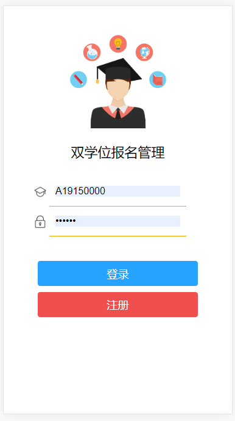
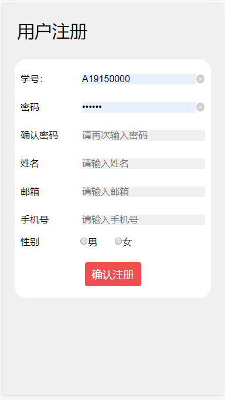
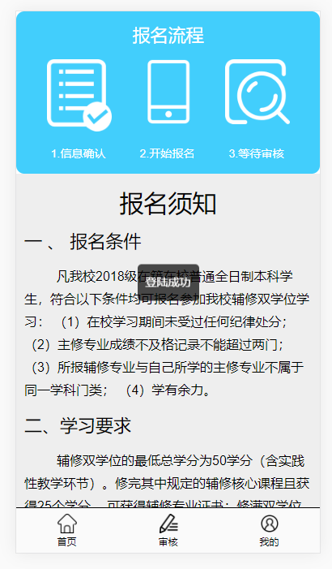
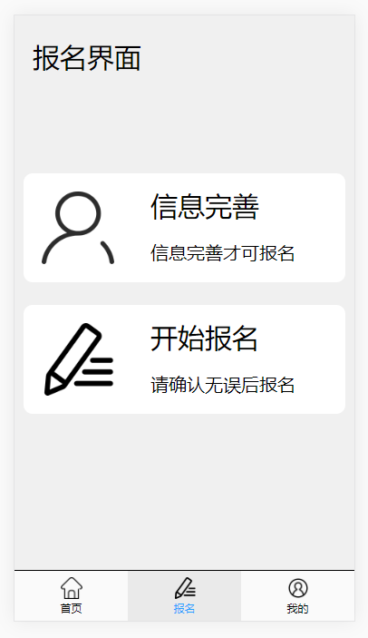
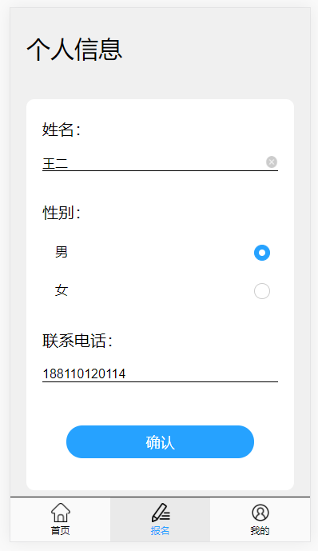
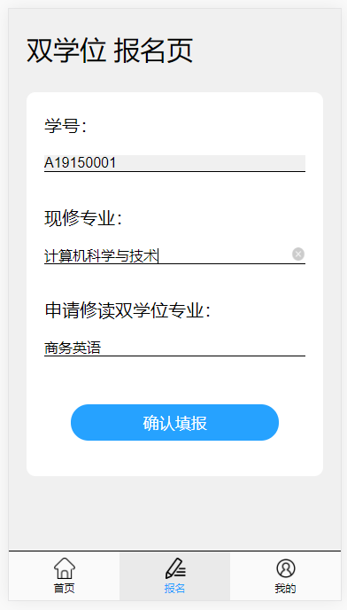
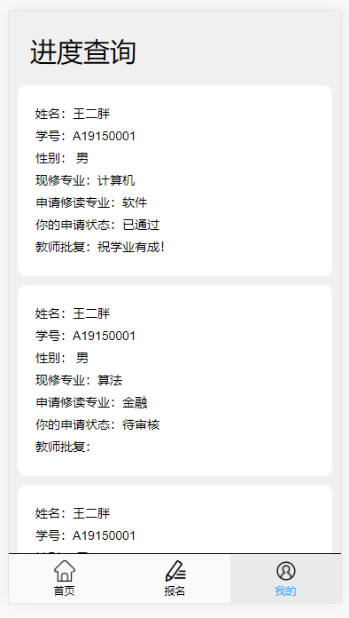
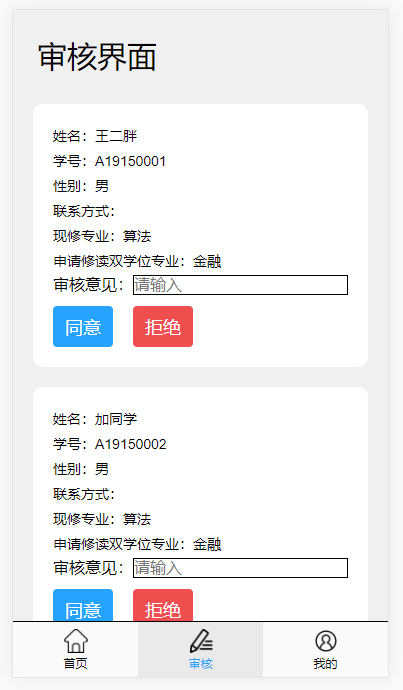
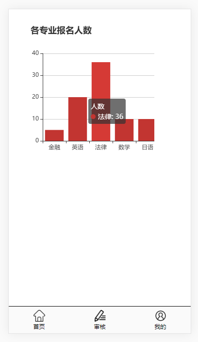

# 双学位报名管理APP

此项目为一个具有普通用户报名和管理员用户审核统计的移动端SPA项目。

## 技术栈

vue2 + vue-router + axios + webpack + mint-ui + sass + echarts

## 项目运行
``` js
// Project setup
npm install

// Compiles and hot-reloads for development
npm run serve

// Compiles and minifies for production
npm run build
```
## 后端接口文档

此项目的所有接口数据都来源于配套的后台系统，基于 nodejs 搭建。

## 说明

* 这是一个比较简单的报名管理系统，基于 Mint-UI 快速搭建界面
* 统计界面的直方图使用 Echarts 绘制


## 部分截图

### 欢迎界面  


### 登录界面  


### 注册界面  


### 用户首页  


### 用户报名页  




### 用户报名进度查询界面  


### 管理员审核界面  


各专业报名统计界面  

